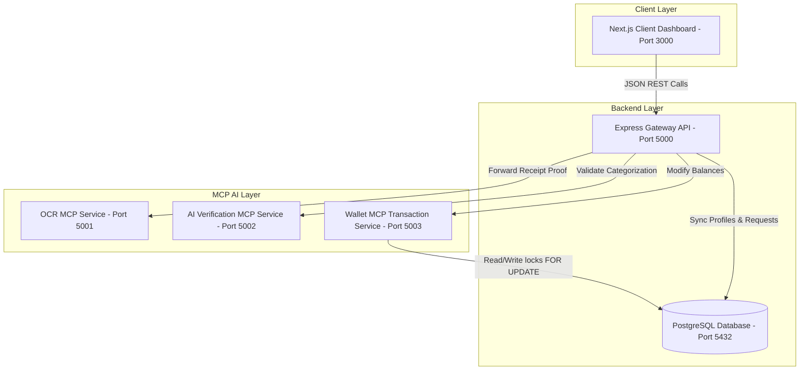

# SmartSave AI Wallet — Save Smart. Spend Only When It Matters.

SmartSave AI Wallet is a production-grade, transaction-secure, AI-powered FinTech mobile wallet application built for the modern consumer. It is designed to help users budget, save money automatically, and protect their savings using an intelligent receipt verification engine.

---

## 1. System Architecture Diagram



---

## 2. Main Subsystems & Ports

1. **Next.js Client**: Port `3000` (Next.js 15, Framer Motion, Tailwind CSS, Zustand, Clerk Authentication)
2. **Express Backend API**: Port `5000` (Node.js, TypeScript, Helmet, Rate Limiter, Swagger, Prisma ORM, Pino Logger)
3. **PostgreSQL Database**: Port `5432` (Prisma schema mapping tables)
4. **OCR MCP Server**: Port `5001` (Python, FastAPI, Tesseract OCR, OpenCV document preprocessor)
5. **AI Verification MCP Server**: Port `5002` (Python, FastAPI, Google Gemini API, exponential retry hooks)
6. **Wallet MCP Server**: Port `5003` (Python, FastAPI, psycopg2-binary, atomic row lock transactions)

---

## 3. Installation & Local Setup

### Prerequisites
- Node.js v18+ & npm
- Python 3.10+
- PostgreSQL active server (or Docker Desktop)

### Environment Configuration
Create a `.env` file in the `server/` directory and `apps/web/.env.local` using the template parameters defined in `.env.example`:

```bash
# Copy template at root
cp .env.example .env
```

---

## 4. Run Locally

### Start all microservices in separate terminal splits (One Command)
If running directly on host OS without Docker, launch our unified launcher scripts:

#### Windows PowerShell:
```powershell
./start-dev.ps1
```

#### macOS / Linux:
```bash
chmod +x start-dev.sh
./start-dev.sh
```

---

## 5. Docker Compose Staging Orchestration

To compile and launch the entire production stack inside a unified Docker container network:

```bash
# Build and boot all 6 service containers
docker-compose up --build
```

---

## 6. Swagger API Documentation

Our Express gateway incorporates automatic Swagger specifications. You can review parameters, payload structures, schemas, and live test queries by navigating to:
👉 **[http://localhost:5000/api-docs](http://localhost:5000/api-docs)**

---

## 7. Hackathon Demo Walkthrough Flow

To test the wallet engine, we seeded a mock account:
- **Test Clerk ID**: `user_2t18bXzV8vPjWj6y1F3y2D4z6k7`
- **Strict Savings Balance**: `$5,000.00`
- **Protected Reserve Limit**: `$1,000.00`

### Case A: Direct Withdrawal (No OCR/AI required)
1. Withdraw `$1,500.00` from Strict Savings.
2. Deducting `$1,500.00` leaves a balance of `$3,500.00`, which is above or equal to the `$1,000.00` Protected Reserve limit.
3. Express skips OCR and AI, invoking the **Wallet MCP** directly. The transfer completes instantly.

### Case B: Approved Withdrawal (AI-Verified Receipt)
1. Withdraw `$4,500.00` from Strict Savings.
2. Deducting `$4,500.00` leaves a balance of `$500.00`, dipping below the `$1,000.00` Protected Reserve limit.
3. Express blocks direct transfer, returning a `PENDING_VERIFICATION` status.
4. Upload `demo/hospital_bill.png.txt` (or similar file) to the verification request.
5. The **OCR MCP** extracts raw text; the **AI MCP** classifies it as `Medical` (Essential).
6. The transfer is approved. **Wallet MCP** updates balances atomically.

### Case C: Blocked Withdrawal (AI-Rejected Expense)
1. Repeat Case B, but upload `demo/shopping_receipt.png.txt` or `demo/gaming_invoice.png.txt`.
2. **AI MCP** classifies the receipt as `Shopping` or `Gaming` (Non-Essential).
3. The transfer is blocked. Balances remain untouched. A warning notification is dispatched to the user.
